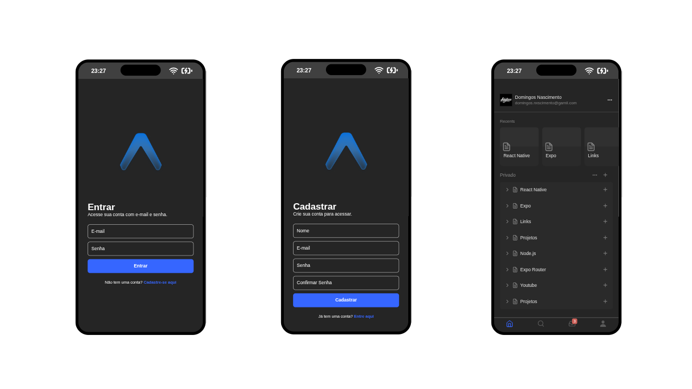

# 🎨 RN-NOTION-UI

This project is a **React Native application** built with **Expo** and **expo-router**, inspired by the clean and modern design of **Notion**.  
The goal is to practice **mobile-first development**, explore **navigation patterns**, and deliver a polished **UI/UX** for study and portfolio purposes.

---

## 🚀 Technologies Used

- React Native (Expo + expo-router)  
- TypeScript  
- @expo/vector-icons   
- GitHub Actions (CI/CD)

---

## 📌 Highlights

- Tab navigation with custom icons (Feather)  
- Dark theme with reusable color palette  
- Badge notifications integrated into tab bar  
- Modular screen structure with expo-router  
- Clean and scalable UI components   
- Documentation in `docs/` for setup and architecture  

---

## 📄 Documentation

- [Architecture](./docs/architecture.md)  
- [Setup Guide](./docs/setup.md)  

---

## 🌐 Access
- **Expo Go (Development):** Run `npx expo start` and scan QR code  

---

## 📸 Demo

---

## 👨‍💻 Author
**Domingos Nascimento**  

- [LinkedIn](https://www.linkedin.com/in/adyllsxn/)  
- [GitHub](https://github.com/Adyllsxn)  

---

## 📄 License

- This project is for educational and portfolio purposes only.